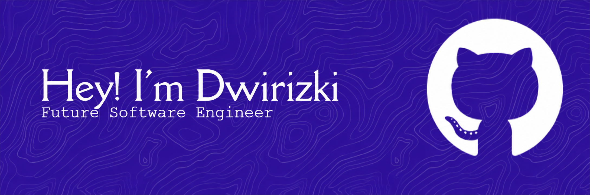

<!-- ========================= BANNER ======================== -->

<p align="center">
  
</p>


<!-- ========================= PROFILE VIEWS ================= -->

<p align="center">
  
</p>

<!-- ========================= QUICK INFO =================== -->

```javascript
const dwirizki = {
    name: "Dwirizki",
    username: "Dwiio",
    role: "Informatics Student",
    university: "Universitas Pembangunan Nasional Yogyakarta",

    focus: "Full Stack Web Development",

    interests: [
        "Web Development",
        "Software Engineering",
        "System Design"
    ],

    currentlyLearning: [
        "Full Stack Development",
        "Data Structures & Algorithms",
        "Software Engineering"
    ],

    goal: "Become a skilled and impactful Software Engineer"
};
```
<br> <!-- ========================= CONTRIBUTION SNAKE =================== -->
<p align="center"> <picture> <source media="(prefers-color-scheme: dark)" srcset="https://raw.githubusercontent.com/Dwiio/Dwiio/output/github-snake-dark.svg" /> <source media="(prefers-color-scheme: light)" srcset="https://raw.githubusercontent.com/Dwiio/Dwiio/output/github-snake.svg" />  </picture> </p> ```
